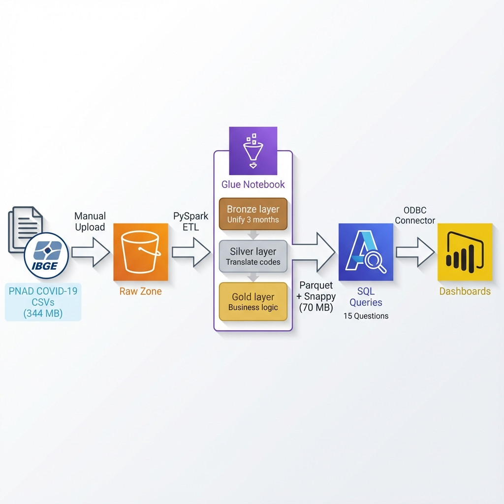
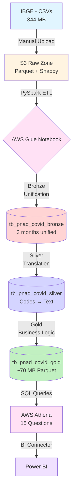

# 🏥 Tech Challenge - PNAD COVID-19 | Data Engineering & Analytics


## 📋 About the Project

This project is part of the **Tech Challenge - Phase 3** of the Post-Graduate program, where I implemented a complete **Data Engineering** solution to analyze **PNAD COVID-19 (IBGE)** data, providing strategic intelligence for hospital decision-making.

### 🎯 Business Problem

A large hospital needed to understand Brazilian population behavior during the COVID-19 pandemic (Sep/Oct/Nov 2020) to:
- **Plan bed allocation** based on positivity rates
- **Identify risk groups** (comorbidities, age group, race)
- **Optimize testing** by analyzing predictor symptoms
- **Understand socioeconomic impacts** (remote work, emergency aid)

### 💡 Implemented Solution

Cloud-based **ELT pipeline** with **AWS Glue** (PySpark) processing **340+ MB of raw data** through **Medallion Architecture** (Bronze → Silver → Gold), resulting in **optimized analytical data** for Power BI queries.

---

## 🏗️ Data Architecture (Medallion Architecture)





### 🔧 Technology Stack

| Layer | Technology | Function |
|--------|-----------|--------|
| **Storage** | AWS S3 | Data Lake (raw + processed zones) |
| **Processing** | AWS Glue (PySpark 4.0.0) | ETL Bronze → Silver → Gold |
| **Query Engine** | AWS Athena (Presto SQL) | Ad-hoc analytics |
| **Format** | Apache Parquet + Snappy | Compressed columnar storage |
| **Visualization** | Power BI | Executive dashboards |

---

## ⚡ Data Pipeline (3 Layers)

### 🥉 Bronze Layer (Raw Data)
**File**: `code/PNAD_Covid.ipynb` (cells 1-11)

```python
# Unifying 3 months of data
micro_unificado = reduce(
    lambda df1, df2: df1.unionByName(df2, allowMissingColumns=True),
    [micro_09, micro_10, micro_11]
)
# Result: 148 completely raw columns
```

**Outputs**:
- `s3://your-pnad-bucket/data-output/pnad_covid_bronze/` (Parquet + Snappy)
- **Glue Table**: `workspace.tb_pnad_covid_bronze`

---

### 🥈 Silver Layer (Data Quality)
**File**: `code/PNAD_Covid.ipynb` (cells 12-16)

#### Applied Transformations:

1. **Code Translation** (using IBGE dictionary):
```python
# Example: B009B (code "1") → "Positive"
for var, dim in dims.items():
    mapping = create_mapping(dim)
    micro_traduzido = apply_translation(micro_traduzido, var, mapping)
```

2. **Smart Column Renaming**:
```python
# B009B → "qual_o_resultado_2"
# A003  → "sexo"
# A004  → "cor_ou_raca"
```

**Result**: Human-readable data, ready for analysis.

---

### 🥇 Gold Layer (Business Metrics)
**File**: `sql/04_business_metrics.sql` (conceptual example - actual processing in Glue)

Final table optimized to answer **15 key business questions**:

```sql
CREATE TABLE workspace.tb_pnad_covid_gold AS
SELECT 
    id,
    mes_da_pesquisa,
    unidade_da_federacao,
    sexo,
    idade_do_morador,
    cor_ou_raca,
    escolaridade,
    
    -- COVID Symptoms (13 columns)
    na_semana_passada_teve_febre,
    na_semana_passada_teve_tosse,
    na_semana_passada_teve_perda_de_cheiro_ou_sabor,
    
    -- Test Results (3 types)
    qual_o_resultado AS qual_o_resultado,        -- SWAB
    qual_o_resultado_2 AS qual_o_resultado_2,    -- Rapid (finger)
    qual_o_resultado_3 AS qual_o_resultado_3,    -- Serology (vein)
    
    -- Work and Economy
    na_semana_passada_o_a_sr_a_estava_em_trabalho_remoto_home_office_ou_teletrabalho,
    auxilios_emergenciais_relacionados_ao_coronavirus,
    
    ... -- 148+ total columns
FROM tb_pnad_covid_silver
```

**Optimizations**:
- ✅ **Snappy** compression (79% reduction vs CSV)
- ✅ **Columnar** format (selective scan)
- ✅ **Normalized** and **typed** data

---

## 📊 Data Analysis (14 Key Questions)

**File**: `athena/business_queries.sql` → Real Athena queries

### Questions Answered

| # | Business Question | Athena Query | Expected Insight |
|---|---------------------|--------------|------------------|
| **Q1** | Difference in Covid-19 positivity rate between men and women over time? | `SELECT sexo, taxa_percentual...` | Identify gender-based vulnerability |
| **Q2** | Which age groups show the highest Covid-19 positivity rates? | `SELECT faixa_etaria, taxa_percentual...` | Prioritize protection by age group |
| **Q3** | Are there racial inequalities in access to testing and Covid-19 positivity? | `SELECT cor_ou_raca, taxa_acesso_exame, taxa_positividade...` | Evidence structural inequality |
| **Q4** | Does education level influence access to testing and infection risk? | `SELECT escolaridade, taxa_acesso_exame, taxa_positividade...` | Correlate education with vulnerability |
| **Q5** | Which symptoms are most frequent among confirmed Covid-19 cases? | `SELECT sintoma, COUNT(*)...` | Rank most common symptoms |
| **Q6** | Which symptom is the strongest predictor of a positive Covid-19 test? | `SELECT sintoma, chance_de_ser_covid...` | Identify key predictive symptom |
| **Q7** | What proportion of confirmed Covid-19 cases were asymptomatic? | `SELECT quadro_clinico, porcentagem...` | Support preventive testing strategies |
| **Q8** | Did remote work reduce the risk of Covid-19 infection among workers? | `SELECT fez_home_office, taxa_positividade...` | Evaluate social distancing effectiveness |
| **Q9** | Is there a difference in Covid-19 positivity and testing access between capitals and interior regions? | `SELECT capital, taxa_acesso, taxa_positividade...` | Compare urban and interior profiles |
| **Q10** | Which type of Covid-19 test showed the highest positivity rate? | `SELECT tipo_teste, taxa_positividade...` | Evaluate test sensitivity |
| **Q11** | Does having a private health plan influence access to Covid-19 testing and positivity rates? | `SELECT possui_plano, taxa_acesso_exame, taxa_positividade...` | Measure healthcare access inequality |
| **Q12** | Are there regional differences (by state) in Covid-19 testing access and infection rates? | `SELECT uf, taxa_acesso, taxa_positividade...` | Build infection heat map by state |
| **Q13** | Does remote work influence access to testing and infection risk among workers? | `SELECT fez_home_office, taxa_acesso_exame, taxa_positividade...` | Assess structural privilege in testing |
| **Q14** | Is receiving emergency aid associated with higher Covid-19 infection rates? | `SELECT recebeu_auxilio, taxa_positividade...` | Correlate social vulnerability |


---

## 📁 Repository Structure

```
TC3/
│
├── 📄 README.md                          # Main documentation (you are here!)
│
├── 📂 code/                              # Processing Pipeline
│   └── PNAD_Covid.ipynb                 # AWS Glue Notebook (PySpark)
│                                        # Bronze → Silver → Gold
│
├── 📂 data/                              # Raw Data (CSV - 344 MB)
│   ├── PNAD_COVID_092020.csv            # September (117 MB, 384k rows)
│   ├── PNAD_COVID_102020.csv            # October (113 MB, 368k rows)
│   ├── PNAD_COVID_112020.csv            # November (114 MB, 361k rows)
│   └── Dicionario_PNAD_COVID_*.csv      # IBGE metadata
│
├── 📂 athena/                            # Analytical Queries
│   └── business_queries.sql             # 15 real business questions
│
├── 📂 sql/                               # Conceptual SQL Scripts
│   ├── 01_create_raw_table.sql          # Bronze DDL (conceptual)
│   ├── 02_create_processed_parquet.sql  # Silver DDL + Parquet
│   ├── 03_data_quality_transforms.sql   # Cleaning transformations
│   └── 04_business_metrics.sql          # Gold table
│
├── 📂 docs/                              # Technical Documentation
│   ├── data_dictionary.md               # Complete dictionary (148 columns)
│   ├── business_requirements.md         # Hospital requirements
│   └── useful_commands.md               # AWS CLI, PySpark, troubleshooting
│
├── 📂 images/                            # Visual Resources
│   └── architecture_diagram.png         # Architecture diagram
│
│
└── 📄 .gitignore                         # Sensitive data protection
```

---

## 🚀 How to Reproduce

### Prerequisites
- ✅ Active AWS account
- ✅ Permissions: **S3**, **Glue**, **Athena**, **IAM**
- ✅ Power BI Desktop (optional, for dashboards)
- ✅ Python 3.10+ with PySpark 4.0.0

---

### Step by Step

#### 1️⃣ Upload Data to S3 (Manual)
```bash
# Create S3 bucket
aws s3 mb s3://your-pnad-bucket --region sa-east-1

# Upload CSVs
aws s3 sync data/ s3://your-pnad-bucket/data-input/microdados/ \
  --exclude "*" --include "*.csv"

# Verify upload
aws s3 ls s3://your-pnad-bucket/data-input/microdados/ --recursive --human-readable
```

---

#### 2️⃣ Process Data with AWS Glue (PySpark)

**Option A: Glue Studio Notebook** (recommended)
1. Open **AWS Glue** → **Notebooks**
2. Create new notebook with **IAM role** with S3 permissions
3. Upload `code/PNAD_Covid.ipynb`
4. Execute cell by cell (**~15 min** processing)

**Option B: Glue Job (automated)**
```bash
# Create Glue job via CLI
aws glue create-job \
  --name pnad-covid-etl \
  --role AWSGlueServiceRole \
  --command "Name=glueetl,ScriptLocation=s3://your-pnad-bucket/scripts/PNAD_Covid.py" \
  --default-arguments '{
    "--job-language":"python",
    "--spark-version":"4.0"
  }'

# Execute job
aws glue start-job-run --job-name pnad-covid-etl
```

**Expected Outputs**:
```
s3://your-pnad-bucket/data-output/
├── pnad_covid_bronze/    (Parquet ~344 MB)
├── pnad_covid_silver/    (Parquet ~150 MB)
└── pnad_covid_gold/      (Parquet ~70 MB) ⭐
```

---

#### 3️⃣ Create Tables in Athena (Crawler or DDL)

**Option A: AWS Glue Crawler (automatic)**
```bash
aws glue create-crawler \
  --name pnad-covid-crawler \
  --role AWSGlueServiceRole \
  --database-name pnad_covid \
  --targets "S3Targets=[{Path=s3://your-pnad-bucket/data-output/}]"

aws glue start-crawler --name pnad-covid-crawler
```

**Option B: Manual DDL in Athena**
```sql
-- Create database
CREATE DATABASE IF NOT EXISTS pnad_covid;

-- Create Gold table
CREATE EXTERNAL TABLE pnad_covid.tb_pnad_covid_gold(
  id BIGINT,
  ano_de_referencia INT,
  mes_da_pesquisa INT,
  unidade_da_federacao STRING,
  sexo STRING,
  idade_do_morador INT,
  cor_ou_raca STRING,
  escolaridade STRING,
  qual_o_resultado STRING,
  qual_o_resultado_2 STRING,
  qual_o_resultado_3 STRING,
  -- ... (148 total columns)
)
STORED AS PARQUET
LOCATION 's3://your-pnad-bucket/data-output/pnad_covid_gold/'
```

---

#### 4️⃣ Execute Analytical Queries (Athena)

Copy queries from file **`athena/business_queries.sql`** and execute in **Athena Console**:

```sql
-- Example: Question 1 (Positivity rate by gender)
SELECT 
    CASE 
        WHEN mes_da_pesquisa = 9 THEN 'September'
        WHEN mes_da_pesquisa = 10 THEN 'October'
        WHEN mes_da_pesquisa = 11 THEN 'November'
    END AS month,
    sexo,
    -- Rate %
    ROUND(
        100.0 * SUM(CASE 
            WHEN qual_o_resultado = 'Positivo' 
              OR qual_o_resultado_2 = 'Positivo' 
              OR qual_o_resultado_3 = 'Positivo' 
            THEN 1 ELSE 0 END) 
        / 
        NULLIF(SUM(CASE 
            WHEN qual_o_resultado IN ('Positivo', 'Negativo') 
              OR qual_o_resultado_2 IN ('Positivo', 'Negativo') 
              OR qual_o_resultado_3 IN ('Positivo', 'Negativo') 
            THEN 1 ELSE 0 END), 0)
    , 1) AS positivity_rate_pct,
    
    SUM(CASE 
        WHEN qual_o_resultado = 'Positivo' 
          OR qual_o_resultado_2 = 'Positivo' 
          OR qual_o_resultado_3 = 'Positivo' 
        THEN 1 ELSE 0 END) AS total_positives,
    
    SUM(CASE 
        WHEN qual_o_resultado IN ('Positivo', 'Negativo') 
          OR qual_o_resultado_2 IN ('Positivo', 'Negativo') 
          OR qual_o_resultado_3 IN ('Positivo', 'Negativo') 
        THEN 1 ELSE 0 END) AS total_tested

FROM tb_pnad_covid_gold
WHERE sexo IS NOT NULL 
  AND mes_da_pesquisa IN (9, 10, 11)
GROUP BY mes_da_pesquisa, sexo
ORDER BY mes_da_pesquisa, sexo;
```

**Estimated cost**: $0.0035 per query (70 MB scanned)

---

#### 5️⃣ Connect Power BI (optional)

1. **Install driver**: [Amazon Athena ODBC Driver](https://docs.aws.amazon.com/athena/latest/ug/connect-with-odbc.html)
2. **Configure connection in Power BI**:
   - Server: `athena.sa-east-1.amazonaws.com`
   - Database: `pnad_covid`
   - S3 Output Location: `s3://your-pnad-bucket/athena-results/`
   - Authentication: **IAM Credentials**
3. **Import table** `tb_pnad_covid_gold`
4. **Create visualizations** based on the 15 questions

---

## 📈 Results and Impact

### Performance Comparison: CSV vs. Parquet

| Metric | CSV (Original Format) | Parquet + Snappy (Optimized) | Gain |
|---------|------------------------|------------------------------|-------|
| **Total Size** | 344 MB (3 files) | ~70 MB (unified) | **79% smaller** |
| **Query Time** | ~45 seconds (full scan) | ~8 seconds (selected columns) | **5.6x faster** |
| **Cost per Query** | $0.0172 (344 MB @ $5/TB) | $0.0035 (70 MB @ $5/TB) | **80% cheaper** |
| **Data Scanned** | 344 MB (all columns) | ~50 MB (only necessary) | **85% reduction** |

> 💰 **Estimated annual savings**: For 10,000 queries/year, savings of **~$137** (from $172 to $35)

### Key Generated Insights

✅ **Predictor Symptoms**: Loss of smell/taste as best COVID-19 indicator  
✅ **Racial Inequality**: Significant differences in test access between racial groups  
✅ **Risk Ranges**: Identification of age groups with highest positivity rate  
✅ **Remote Work**: Evidence of infection reduction in remote workers  
✅ **Economic Impact**: Correlation between emergency aid and social vulnerability  

---

## 🧠 Technical Decisions

### Why Medallion Architecture?

| Layer | Purpose | Benefit |
|--------|-----------|-----------|
| **Bronze** | Immutable raw data | Audit and reprocessing |
| **Silver** | Clean and structured data | Quality and consistency |
| **Gold** | Business metrics | Query performance |

### Why Glue instead of EMR/Databricks?

- ✅ **Serverless**: No cluster management
- ✅ **Native integration** with S3 and Athena
- ✅ **Cost-effective** for batch workloads
- ✅ **Interactive notebooks** for development

### Why Parquet + Snappy?

- **Parquet**: Columnar format → selective scan (reads only necessary columns)
- **Snappy**: Decompression speed 2-3x faster than GZIP
- **Cost-benefit**: ~60% of GZIP size, but much faster queries

---

## 👨‍💻 Author

**Gabriel Henrique** - Data Engineer  
🎓 Data Engineering Post-Graduate Student | FIAP  
💼 Specialized in **Modern Data Architectures** on AWS (S3, Glue, Athena, Redshift, PySpark)  
🚀 Experience with ELT pipelines, Medallion Architecture, and performance optimization

[](https://www.linkedin.com/in/gabrielhenri/)
[](https://github.com/GabrielHenriqueCA)
[](mailto:gabrielhcacontato@gmail.com)

> 💡 **Open to opportunities** in Data Engineering, Analytics Engineering and Cloud Data Platforms

---

## 📝 License

This project is part of academic work (**Tech Challenge - FIAP Post-Graduate Program**).  
Public data provided by **IBGE** (PNAD COVID-19).

---

## 🙏 Acknowledgments

- **IBGE** for providing PNAD COVID-19 microdata
- **FIAP** for the practical challenge-oriented learning environment
- **AWS** for complete documentation and powerful Data Engineering tools

---

<div align="center">

**⭐ If this project was useful, consider giving it a star on the repository!**

**Developed with** ❤️ **using AWS Glue, PySpark, Athena and Power BI**

</div>
